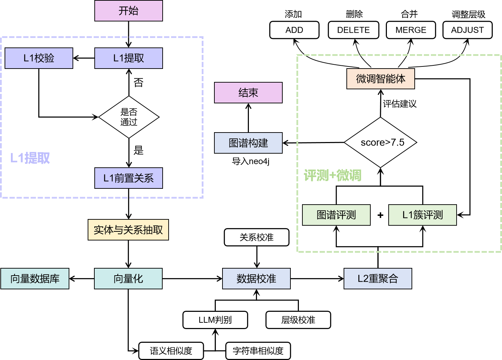

## Knowledge Graph Builder

Build a **course knowledge graph** from textbook chapters (CSV) and TOC files, then **evaluate**, **refine**, and optionally **import to Neo4j**.

<div align="left">
  <a href="./LICENSE">
    
  </a>
  <a href="./pyproject.toml">
    
  </a>
  <a href="./CHANGELOG.md">
    
  </a>
</div>

### Pipeline at a glance



### Interactive preview (GitHub Pages)

GitHub README can’t run JavaScript. The full interactive matrix lives on GitHub Pages. Enable Pages, then click the preview:

[](docs/index.html)

---

## Overview

What you get:

- Multi-level nodes: **L1/L2/L3/L4** knowledge points
- Relations like `contains` / `prerequisite`
- Traceable evaluation artifacts per run (`run_id`) + per-cluster markdown reports
- A refinement loop: **MERGE / ADD / DELETE** (+ rollback safety)
- Optional Neo4j import (**knowledge-point graph only**, filters `has_resource`)

---

## Quickstart

⚠️ **Warning**: LLM extraction/evaluation can be costly. Start small, verify outputs, then scale up.

### Requirements

- Python **3.10+**
- Optional: Neo4j **5.x** (only needed for Step 8)

### Install

```bash
poetry install
```

### Configure (local config is not committed)

The pipeline loads `config/default.yaml`. Recommended:

- Copy `config/default.example.yaml` → `config/default.yaml`
- Fill `api_key / api_base / model` in your local `config/default.yaml`

### Run full pipeline

```bash
poetry run python -m knowledge_graph.pipeline
```

Equivalent entrypoint:

```bash
poetry run python -m knowledge_graph
```

---

## Enable GitHub Pages (to run the demo)

1. Repo → **Settings** → **Pages**
2. Build and deployment
   - Source: **Deploy from a branch**
   - Branch: **main**, Folder: **/docs**
3. Wait ~1–2 minutes, then open:
   - `https://<username>.github.io/<repo>/`

---

## Common commands

### Run a single step (debug-friendly)

`step` is a positional argument (see `knowledge_graph/__main__.py`):

- `extract_l1|validate_l1|extract_l1_rels|extract|vectorize|calibrate|evaluate|build`

```bash
poetry run python -m knowledge_graph extract
poetry run python -m knowledge_graph evaluate
poetry run python -m knowledge_graph build
```

### Two important loop knobs

```bash
# L1 extraction↔validation max loops (default: 3)
poetry run python -m knowledge_graph full --max-loops 3

# evaluation↔refinement max loops (default: 5)
poetry run python -m knowledge_graph full --max-eval-loops 2
```

### Incremental mode (only new input files)

```bash
poetry run python -m knowledge_graph full --incremental
```

---

## Outputs (where to look)

- `data/output/stage1_entities.parquet` (Step 1–2)
- `data/output/stage2_relationships.parquet` (Step 3)
- `data/output/stage3_{entities,relationships,resources}.parquet` (Step 4)
- `data/output/calibrated_{entities,relationships}.parquet` (Step 6; may be overwritten by 6.5 / 7.5)
- `data/output/evaluation/<run_id>/*` + `data/output/evaluation/latest.json` (Step 7)
- `data/output/final_evaluation/**` (latest evaluation sync, incl. `clusters/*.md`)

---

## Repository guidance

- Flow overview + loops: `docs/项目流程/00_总体说明与全架构图.md`
- Implementation-level doc: `docs/项目流程/11_全流程细节级实现说明.md`
- Doc↔code map: `docs/文档与代码对照表.md`
- Development: `docs/development.md`

---

## Important boundaries (easy to misunderstand)

- Vectorization (Step 5) embeds **knowledge points only** (resources are ignored).
- Evaluation (Step 7) filters `has_resource` (resources do not participate).
- Neo4j import (Step 8) imports **knowledge points graph only** (filters `has_resource`).

---

## Features

### Core capabilities

- **L1 extraction + validation loop** (`--max-loops`)
- **L1 prerequisite relation mining**
- **Entity/relationship/resource extraction** from chapter CSVs (resources are stored separately)
- **Vector store support** (currently embeds **knowledge points only**)
- **Calibration & cleanup** (dedupe / hierarchy / relation sanity checks)
- **Evaluation + refinement loop** (**MERGE / ADD / DELETE**) with traceable artifacts per run
- **Optional Neo4j import** (knowledge-point graph only, filters `has_resource`)

### Engineering experience

- **Run artifacts are traceable**: `data/output/evaluation/<run_id>/*` + `final_evaluation/**`
- **Incremental processing**: `--incremental` with `data/processed_files.json`
- **Stage-by-stage Parquet outputs** for debugging and resuming

---

## Repository structure

```text
graph/
├── config/                 # local config (ignored, not committed)
├── data/
│   ├── input/              # inputs (chapter CSVs, TOC files, etc.)
│   └── output/             # outputs (ignored)
├── docs/                   # docs + GitHub Pages demo (/docs)
├── prompts/                # prompt templates
├── knowledge_graph/
│   ├── __main__.py         # CLI entry (single steps / args)
│   ├── pipeline.py         # main pipeline + loop controllers
│   ├── agents/             # agents (1-8 + 6.5 + 7.5)
│   └── utils/              # config/logging/LLM/vector db helpers
└── tests/                  # tests
```

---

## Data flow (aligned with current code)

```text
Inputs
  │
  ├─→ data/input/Table_of_Contents/*.txt   # TOC files
  └─→ data/input/*.csv                    # chapter content (excluding *目录.csv)
          │
          ▼
Step 1–2: L1 extraction + validation loop
          │
          ▼ data/output/stage1_entities.parquet
Step 3: L1 prerequisite relations
          │
          ▼ data/output/stage2_relationships.parquet
Step 4: entity / relationship / resource extraction
          │
          ▼ data/output/stage3_{entities,relationships,resources}.parquet
Step 5–6: vectorize (KPs only) + calibrate
          │
          ▼ data/output/calibrated_{entities,relationships}.parquet
Step 6.5: recluster (aggregate L2, sink levels to L3/L4)
          │
Step 7 ↔ 7.5: evaluate ↔ refine (MERGE/ADD/DELETE)
          │
Step 8: Neo4j import (KPs only, filters has_resource)
```

---

## What’s new in this update

- **Better onboarding**: README now links to a real interactive demo (README preview + full GitHub Pages site)
- **Safe example config**: added `config/default.example.yaml` (commented template, no secrets)
- **Docs are aligned with code**: `docs/**` updated to match the current pipeline (6.5/7.5, evaluation artifacts, resource boundaries)

