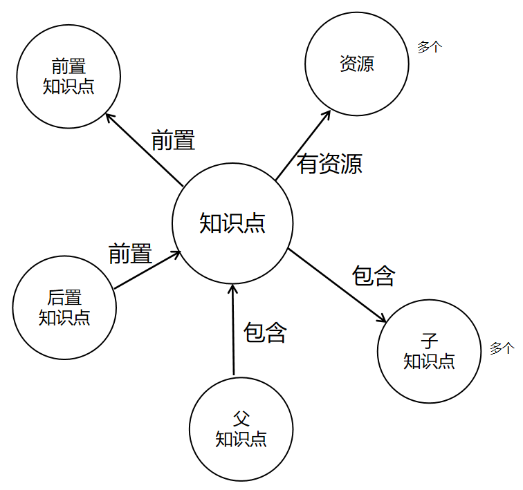

# Knowledge Graph Builder - 知识图谱构建工具

[English](./README.md) | 中文

<div align="center">


[](https://www.python.org/)
[](./LICENSE)
[](https://github.com/wzm110/knowledge-graph)

面向教育与学习场景的知识图谱构建系统，支持多教材并存、前置关系推理与学习路径规划。

</div>

## 系统架构


## 图数据库Schema



## 项目目标

在真实教学与学习过程中，同一学科通常存在多种教材、课程与教学资源，不同教材在章节划分、知识点顺序、讲解深度上存在显著差异。然而，学习者真正需要掌握的是稳定的知识点体系，而不是某一本教材的章节结构。

本系统的核心业务目标是：
- 将教材结构与知识体系解耦，构建统一的知识本体图谱
- 在此基础上支撑智能学习与教学应用
- 支持前置关系推理与学习路径规划

## 功能特性

- **多教材支持**: 解耦教材结构与知识体系
- **层次化知识点**: L1（顶层）、L2、L3（详细）三级概念体系
- **前置关系推理**: 使用LLM自动推断学习前置关系
- **LLM评测**: 对图谱质量进行自动化评估
- **学习路径规划**: 基于知识图谱构建个性化学习路径
- **Neo4j集成**: 存储和查询知识图谱
- **向量相似度搜索**: 支持语义相似度检索

## 建图流程（8步）

```
┌─────────────────────────────────────────────────────────────────────┐
│                        知识图谱构建流程                                │
├─────────────────────────────────────────────────────────────────────┤
│                                                                      │
│  ┌──────────────┐     ┌──────────────┐     ┌──────────────┐       │
│  │  步骤1       │     │  步骤2       │     │  步骤3       │       │
│  │  提取L1概念   │ ──→ │  L1概念校验   │ ──→ │  提取L1前置  │       │
│  │              │     │              │     │    关系      │       │
│  └──────────────┘     └──────────────┘     └──────────────┘       │
│         │                    │                    │                  │
│         │                    │                    ▼                  │
│         │                    │              ┌──────────────┐         │
│         │                    │              │  步骤4       │         │
│         │                    │              │  提取实体关系 │         │
│         │                    │              └──────────────┘         │
│         │                    │                    │                  │
│         ▼                    ▼                    ▼                  │
│  ┌─────────────────────────────────────────────────────────────┐   │
│  │                      步骤5: 向量处理                         │   │
│  │              (向量化 + 存储到向量数据库)                     │   │
│  └─────────────────────────────────────────────────────────────┘   │
│                              │                                    │
│                              ▼                                    │
│  ┌─────────────────────────────────────────────────────────────┐   │
│  │                      步骤6: 数据校准                        │   │
│  │         (去重、层级归属、实体合并、关系验证)                 │   │
│  └─────────────────────────────────────────────────────────────┘   │
│                              │                                    │
│                              ▼                                    │
│  ┌─────────────────────────────────────────────────────────────┐   │
│  │                      步骤7: LLM评测                         │   │
│  │              (质量评估 + 改进建议生成)                       │   │
│  └─────────────────────────────────────────────────────────────┘   │
│                              │                                    │
│                              ▼                                    │
│  ┌─────────────────────────────────────────────────────────────┐   │
│  │                      步骤8: 图谱更新                         │   │
│  │              (更新向量库 + 导入Neo4j)                       │   │
│  └─────────────────────────────────────────────────────────────┘   │
│                                                                      │
└─────────────────────────────────────────────────────────────────────┘
```

### 详细步骤说明

1. **步骤1: 提取L1概念**
   - 输入: 多本教材的章节目录
     - `data/input/Table_of_Contents/动手学深度学习_章节目录.txt`
     - `data/input/Table_of_Contents/深度学习DeepLearning_章节目录.txt`
     - `data/input/Table_of_Contents/神经网络与深度学习_章节目录.txt`
   - 通过LLM从多本教材的章节目录中提取统一的顶层知识点（L1概念）
   - 输出: L1概念列表（统一的知识体系）

2. **步骤2: L1概念校验**
   - 输入: 步骤1提取的L1概念列表
   - 通过LLM对每个L1概念进行质量评估和打分
   - 输出: 带评分和反馈的L1概念列表

3. **步骤3: 提取L1前置关系**
   - 输入: 步骤2校验后的L1概念列表
   - 通过LLM分析L1概念之间的学习前置关系
   - 输出: L1前置关系列表

4. **步骤4: 提取实体关系**
   - 输入: 已分块的CSV教材数据
   - 提取知识点（L2、L3）、关系和资源
   - 输出: 实体列表、关系列表、资源列表

5. **步骤5: 向量处理**
   - 将提取的实体进行向量化
   - 存储到向量数据库（用于语义相似度搜索）

6. **步骤6: 数据校准**
   - 实体去重、层级归属确定、关系验证
   - 整合L1前置关系到整体关系图

7. **步骤7: LLM评测**
   - 输入: 校准后的完整知识图谱
   - 通过LLM对图谱整体质量进行评估
   - 输出: 质量评估报告和改进建议

8. **步骤8: 图谱更新**
   - 更新向量数据库
   - 导入Neo4j图数据库

## 快速开始

### 环境要求

- Python 3.10+
- Neo4j 5.x
- OpenAI API Key（或兼容API）

### 安装

```bash
# 克隆仓库
git clone https://github.com/wzm110/knowledge-graph.git
cd knowledge-graph

# 安装依赖
poetry install

# 配置API Key
export OPENAI_API_KEY=your-api-key
# 或编辑 .env 文件
```

### 使用

```bash
# 完整流程
poetry run python -m knowledge_graph

# 分步执行
poetry run python -m knowledge_graph extract_l1      # 步骤1
poetry run python -m knowledge_graph validate_l1     # 步骤2
poetry run python -m knowledge_graph extract_l1_rels  # 步骤3
poetry run python -m knowledge_graph extract           # 步骤4
poetry run python -m knowledge_graph vectorize        # 步骤5
poetry run python -m knowledge_graph calibrate         # 步骤6
poetry run python -m knowledge_graph evaluate          # 步骤7
poetry run python -m knowledge_graph build             # 步骤8
```

## 项目结构

```
knowledge-graph/
├── config/                    # 配置文件
├── data/
│   └── input/               # 输入教材数据
│       ├── *_目录.txt        # 教材章节目录（多本）
│       └── *.csv            # 分章教材内容
├── docs/                     # 文档和图片
├── knowledge_graph/          # 主包
│   ├── steps/              # 处理步骤
│   │   ├── extract_l1.py       # 步骤1: 提取L1概念
│   │   ├── validate_l1.py      # 步骤2: L1概念校验
│   │   ├── extract_l1_rels.py  # 步骤3: 提取L1前置关系
│   │   ├── extract.py           # 步骤4: 提取实体关系
│   │   ├── vectorize.py         # 步骤5: 向量处理
│   │   ├── calibrate.py         # 步骤6: 数据校准
│   │   ├── evaluate.py          # 步骤7: LLM评测
│   │   └── build.py             # 步骤8: 图谱构建
│   └── utils/              # 工具模块
├── tests/                   # 测试
└── prompts/                 # LLM提示词
```

## 知识层次

| 层级 | 说明 | 示例 |
|------|------|------|
| L1 | 顶层概念 | 神经网络基础、卷积神经网络 |
| L2 | 子概念 | 反向传播、激活函数 |
| L3 | 详细知识点 | Sigmoid梯度计算 |

## 关系类型

| 类型 | 说明 |
|------|------|
| `contains` | 层级包含关系（L1→L2→L3） |
| `prerequisite` | 学习前置关系 |
| `has_resource` | 关联学习资源 |

## 数据说明

本项目包含的教材数据为**示例数据**，来自 [D2L (动手学深度学习)](https://d2l.ai/) 课程内容。

## 许可证

MIT License - 详见 [LICENSE](./LICENSE)

## 贡献

欢迎提交 Pull Request！

## 致谢

- [D2L (动手学深度学习)](https://d2l.ai/) - 示例教材数据来源
- [OpenAI](https://openai.com/) - LLM API
- [Neo4j](https://neo4j.com/) - 图数据库
