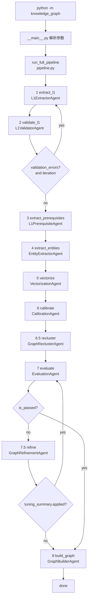

# 知识图谱构建系统 - 当前架构说明（代码对齐版）

本文档用于说明 **当前仓库中已实现的流水线架构**，作为 `docs/` 系列文档的“事实源索引”。  
说明基于当前代码：`knowledge_graph/pipeline.py`、`knowledge_graph/__main__.py`、`knowledge_graph/agents/*.py`。

> 说明：本仓库已不再包含 `knowledge_graph/langgraph_pipeline.py` / `knowledge_graph/langgraph_state.py` 等文件；也不再以 LangGraph 作为运行时依赖。历史规划内容已从本文件移除，避免误导。

## 1. 总体流程（含双循环）



## 2. 入口与命令行参数（以 `__main__.py` 为准）

- **运行入口**：`python -m knowledge_graph`
- **step（位置参数）**：
  - `full`（默认）：跑完整流程
  - `extract_l1|validate_l1|extract_l1_rels|extract|vectorize|calibrate|evaluate|build`：单步执行
- **关键开关**：
  - `--max-loops`：步骤1-2 最大循环次数
  - `--max-eval-loops`：评测↔微调最大循环次数
  - `--incremental`：增量处理（跳过/回读部分阶段产物）
  - `--full-refresh-l1`：强制全量重跑步骤1-2（否则可能复用 `data/output/stage1_entities.parquet` 并跳过）

## 3. 统一状态（PipelineState）

当前实现使用 `PipelineState(dict)`（定义在 `knowledge_graph/pipeline.py`），在同一个 `state` 中跨步骤传递：

- **L1阶段**：`l1_concepts`、`validated_l1_concepts`、`validation_errors`、`iteration`
- **抽取阶段**：`textbook_data`、`knowledge_points`、`relationships`、`resources`
- **校准后主数据**：`calibrated_kps`、`calibrated_relationships`（资源通常不进入 calibrated）
- **评测/微调**：`evaluation_report`、`evaluation_iteration`、`tuning_summary`
- **入库**：`neo4j_imported`

## 4. 关键能力边界（容易写错的点）

- **6.5 重聚合真实行为**（`agents/recluster.py`）：
  - old L2 下沉为 L3、old L3 下沉为 L4，并重写 contains 关系；
  - 下沉后会做 **id 前缀规范化**（确保下沉节点不再保留 `l2_` 前缀）。
- **7 评测的通过判定**（`agents/evaluation.py`）：
  - 会综合全局评测分、簇评测分得到 `final_score`；
  - 通过阈值、blocking_issues、最低簇分等规则以代码为准（不要在文档里写死旧阈值）。
- **7.5 微调并非“仅 ADD”**（`agents/refinement.py`）：
  - 支持 `MERGE/ADD/DELETE`，动作顺序是 `MERGE → ADD → DELETE`；
  - ADD 既可能补 `L1->L2` 也可能补 `L2->L3`，且有上限约束。
- **资源与 has_resource 的处理**：
  - Step4 会落盘 `stage3_resources.parquet`；
  - 评测与 Neo4j 入库阶段通常会过滤 `has_resource`，只处理知识点图（见 `agents/evaluation.py`、`agents/graph_builder.py`）。

## 5. 输出产物（高频核对项）

- `data/output/stage1_entities.parquet`：步骤1/2（L1提取与验证）
- `data/output/stage2_relationships.parquet`：步骤3（L1前置关系）
- `data/output/stage3_entities.parquet` / `stage3_relationships.parquet` / `stage3_resources.parquet`：步骤4
- `data/output/calibrated_entities.parquet` / `calibrated_relationships.parquet`：步骤6（随后 6.5/7.5 可能覆盖更新）
- `data/output/evaluation/<run_id>/*` + `data/output/evaluation/latest.json`：步骤7评测归档
- `data/output/final_evaluation/**`：最新评测同步输出（含 `clusters/*.md`）

## 6. 文件结构（当前实现）

```
knowledge_graph/
├── __main__.py
├── pipeline.py
├── agents/
│   ├── base_agent.py
│   ├── l1_extractor.py
│   ├── l1_validator.py
│   ├── l1_prerequisite.py
│   ├── entity_extractor.py
│   ├── vectorization.py
│   ├── calibration.py
│   ├── recluster.py
│   ├── evaluation.py
│   ├── refinement.py
│   └── graph_builder.py
└── utils/
    ├── config.py
    ├── vector_db.py
    └── ...
```

