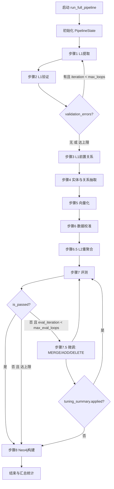
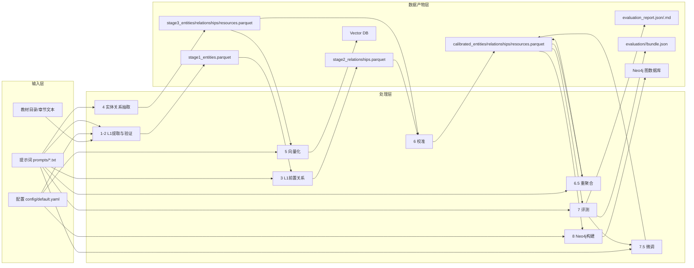
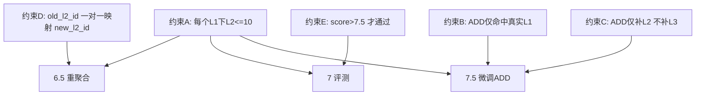

# 知识图谱构建流程总体说明（当前版本）

本文档描述当前代码实现下的端到端流程、循环控制、关键约束与数据产物位置。  
对应主入口：`knowledge_graph/pipeline.py`、`knowledge_graph/__main__.py`。

## 1. 总体目标

- 从教材与章节文本中抽取课程知识图谱。
- 通过评测-微调闭环提升结构质量。
- 将最终图谱写入 Neo4j，并输出可追溯评测结果。

## 2. 全流程架构图

### 2.0 架构总图（PNG）

> 本仓库以 `docs/architecture.png` 作为对外展示的架构总图。

### 2.1 控制流总图（含双循环）

### 2.2 数据流总图（输入/中间产物/最终产物）

### 2.3 关键约束挂点图（在哪一步生效）

## 3. 关键循环与停止条件

- **L1提取-验证循环**：最多 `--max-loops` 次（默认 3）。
- **评测-微调循环**：最多 `--max-eval-loops` 次（默认 5）。
- **评测通过条件**：以 `knowledge_graph/agents/evaluation.py` 的实现为准（当前会融合全局/簇评分得到 `final_score`，并结合 `blocking_issues` 与最低簇分判定 `is_passed`）。
- 微调若无可执行动作（`tuning_summary.applied=false`）提前停止循环。

## 4. 当前版本核心约束

- 微调阶段支持 `MERGE` / `ADD` / `DELETE`，动作顺序为 **MERGE→ADD→DELETE**（见 `knowledge_graph/agents/refinement.py`）。
- `ADD` 父节点可为 `L1`（补 `L2`）或 `L2`（补 `L3`），并受上限约束。
- 每个 `L1` 下 `L2` 数量上限为 `10`（评测与微调双重限制）。
- 重聚合仅执行一层：
  - 原 `L2 -> L3`
  - 原 `L3 -> L4`
  - 新生成聚合簇作为新的 `L2`
- `old_l2_id` 在重聚合映射中必须且只能归属一个 `new_l2_id`。

## 5. 主要数据产物

- `data/output/stage1_entities.parquet`：L1结果（步骤1/2）。
- `data/output/stage2_relationships.parquet`：L1前置关系（步骤3）。
- `data/output/stage3_entities.parquet` / `stage3_relationships.parquet` / `stage3_resources.parquet`（步骤4）。
- `data/output/calibrated_entities.parquet` / `calibrated_relationships.parquet`（步骤6后主数据，步骤6.5/7.5会继续覆盖更新）。
- `data/output/evaluation/<run_id>/bundle.json` / `evaluation_report.md` / `clusters/*.md`（步骤7分轮归档）。
- `data/output/evaluation/latest.json`（历史快照索引）。
- `data/output/final_evaluation/**`（最新评估同步输出）。

## 6. 文档导航

- `01_步骤1_L1提取.md`
- `02_步骤2_L1验证.md`
- `03_步骤3_L1前置关系提取.md`
- `04_步骤4_实体与关系抽取.md`
- `05_步骤5_向量化.md`
- `06_步骤6_数据校准.md`
- `07_步骤6_5_L2重聚合.md`
- `08_步骤7_评测.md`
- `09_步骤7_5_微调.md`
- `10_步骤8_Neo4j构建.md`
