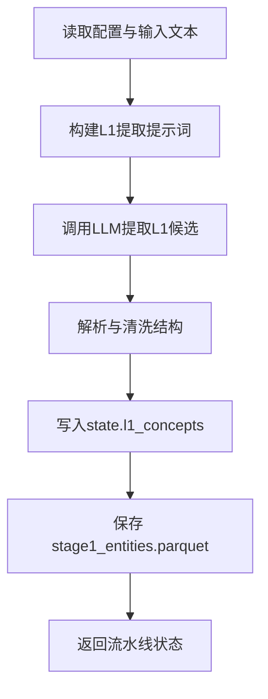

# 步骤1：L1提取（`extract_l1`）

对应实现：`knowledge_graph/agents/l1_extractor.py`

## 架构流程图

## 详细实现说明

- **输入**
  - `state.config`
  - 教材文本与章节内容（由前序装载逻辑提供）
  - 可选反馈：`state.validation_errors` 转换为提取反馈，指导重提取。
- **核心逻辑**
  - 构建 L1 提取提示词并调用 LLM。
  - 解析输出为标准实体字段（`id/name/level/definition/...`）。
  - 在验证循环中可携带“上轮错误反馈”进行修正抽取。
- **输出**
  - `state.l1_concepts`
  - `data/output/stage1_entities.parquet`
- **异常处理**
  - 解析失败或模型异常会写入 `state.errors`，由主流程统一中断/记录。

