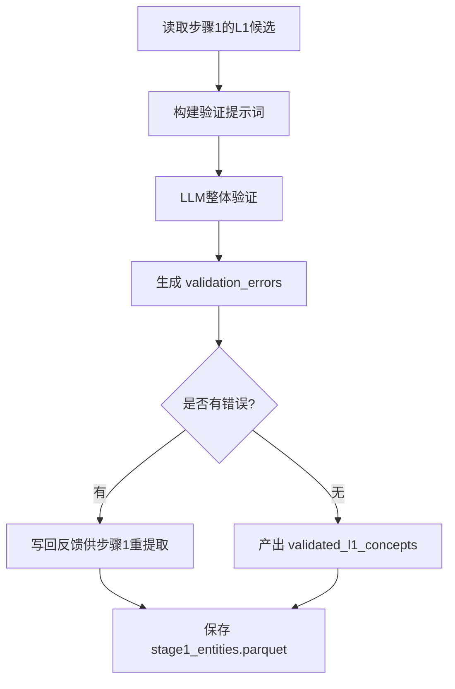

# 步骤2：L1验证（`validate_l1`）

对应实现：`knowledge_graph/agents/l1_validator.py`

## 架构流程图

## 详细实现说明

- **输入**
  - `state.l1_concepts`
  - 课程上下文配置（含 `pipeline.subject`）。
- **核心逻辑**
  - 当前实现采用“整体系统验证”：一次性对全部 L1 列表进行评估，产出整体反馈与是否有效（见 `knowledge_graph/agents/l1_validator.py`）。
  - 若未通过，会将整体反馈收敛为 `validation_errors`（用于下轮提取反馈）。
- **循环控制（在 pipeline 中）**
  - 若有错误且未达 `--max-loops`：回到步骤1重提取。
  - 若达上限仍有错误：记录告警后继续后续步骤。
- **输出**
  - `state.validated_l1_concepts`
  - `state.validation_errors`
  - `data/output/stage1_entities.parquet`（验证后的版本）。

