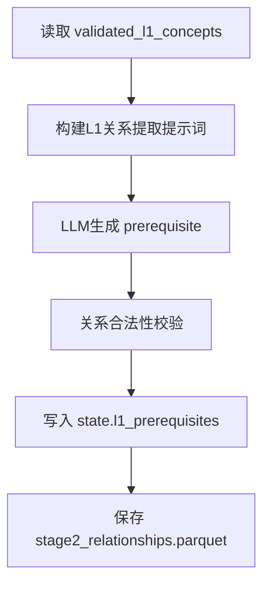

# 步骤3：L1前置关系提取（`extract_prerequisites`）

对应实现：`knowledge_graph/agents/l1_prerequisite.py`

## 架构流程图

## 详细实现说明

- **输入**
  - `state.validated_l1_concepts`
- **核心逻辑**
  - 仅在 L1 粒度提取前置依赖关系。
  - 输出关系规范字段：`start_id/end_id/type/reason`。
- **输出**
  - `state.l1_prerequisites`
  - `data/output/stage2_relationships.parquet`
- **边界**
  - 增量模式可跳过该步骤并加载历史 `stage2_relationships.parquet`。

