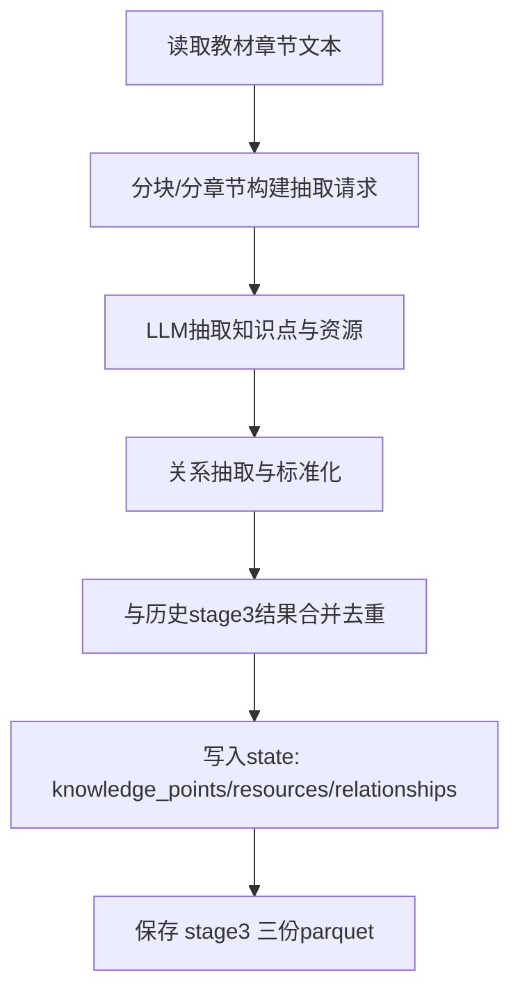

# 步骤4：实体与关系抽取（`extract_entities`）

对应实现：`knowledge_graph/agents/entity_extractor.py`

## 架构流程图

## 详细实现说明

- **输入**
  - 文本内容、L1主题集合、配置参数（测试模式可限制章节数）。
- **核心逻辑**
  - 提取知识点（含层级信息）、资源、关系。
  - 合并历史产物时进行去重与增量融合。
  - 保持实体字段与关系字段一致性，供后续校准阶段统一处理。
- **输出**
  - `state.knowledge_points`
  - `state.resources`
  - `state.relationships`
  - `data/output/stage3_entities.parquet`
  - `data/output/stage3_resources.parquet`
  - `data/output/stage3_relationships.parquet`
- **约束**
  - 资源关联关系 `has_resource` 的挂载规则由提示词约束，后续在校准与重聚合中继续保持一致。

