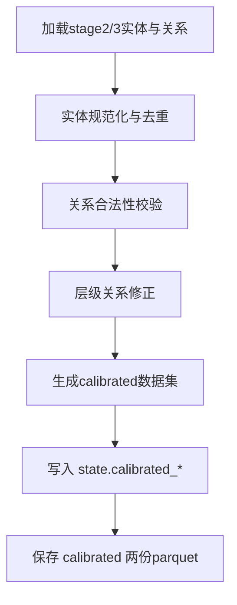

# 步骤6：数据校准（`calibrate`）

对应实现：`knowledge_graph/agents/calibration.py`

## 架构流程图

## 详细实现说明

- **输入**
  - `stage2_relationships.parquet`
  - `stage3_entities.parquet`
  - `stage3_relationships.parquet`
- **核心逻辑**
  - 合并多来源数据，清理重复与脏关系。
  - 校验关系端点存在性与层级合法性（包含重聚合后的层级关系约束）。
  - 产出稳定、可评测、可入图的数据基线。
- **输出**
  - `state.calibrated_kps`
  - `state.calibrated_resources`（当前实现通常为空：资源不进入 calibrated）
  - `state.calibrated_relationships`
  - `data/output/calibrated_entities.parquet`
  - `data/output/calibrated_relationships.parquet`
- **在后续流程中的作用**
  - 作为重聚合、评测、微调、入库的统一数据源。

