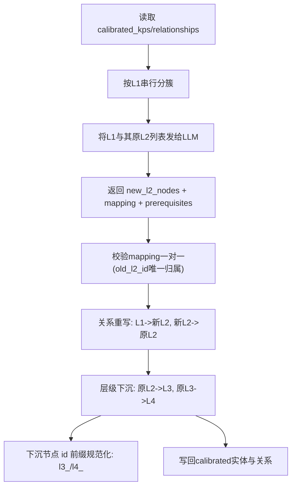

# 步骤6.5：L2重聚合（`regroup_graph`）

对应实现：`knowledge_graph/agents/recluster.py`、提示词 `prompts/Recluster_Prompt.txt`

## 架构流程图

## 详细实现说明

- **执行时机**
  - 在步骤6之后、步骤7之前，仅执行一次（`recluster_applied` 守卫）。
- **核心目标**
  - 每个 `L1` 下重新生成不超过 `10` 个聚合 `L2`。
  - 原 `L2` 保留但下沉为 `L3`，原 `L3` 下沉为 `L4`。
- **关键约束**
  - `old_l2_id` 必须且只能映射到一个 `new_l2_id`。
  - 只做单层重聚合，避免重复下沉。
- **资源与 has_resource**
  - 当前重聚合步骤只处理知识点与知识点关系（contains/prerequisite），不处理资源数据；后续评测与入库阶段也会过滤 `has_resource`（见步骤7/8说明）。
- **输出**
  - 更新后的 `state.calibrated_kps` 与 `state.calibrated_relationships`
  - 覆盖写回：
    - `data/output/calibrated_entities.parquet`
    - `data/output/calibrated_relationships.parquet`

