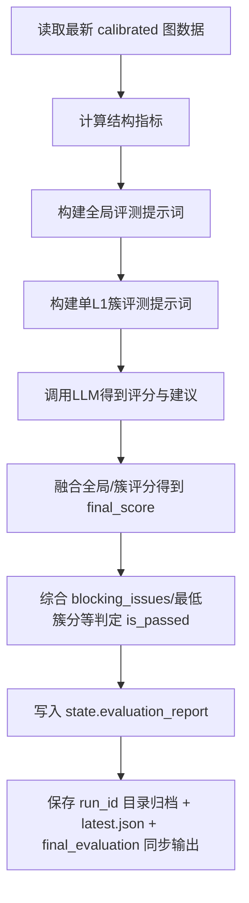

# 步骤7：评测（`evaluate`）

对应实现：`knowledge_graph/agents/evaluation.py`  
提示词：`prompts/Evaluation_Prompt.txt`、`prompts/Cluster_Evaluation_Prompt.txt`

## 架构流程图

## 详细实现说明

- **输入**
  - 最新 `state.calibrated_kps`、`state.calibrated_relationships`（若 state 缺失可回读 parquet）。
  - 课程信息：`config.pipeline.subject`，注入簇评测提示词。
- **评测内容**
  - 全局评分（结构、覆盖、准确性等）。
  - 各 `L1` 簇细粒度评分与改进建议。
  - 输出可执行 `adjustment_suggestions`（供步骤7.5使用）。
- **通过规则**
  - 当前实现会计算 `final_score`（融合全局与簇评分，并对低分簇施加惩罚），再结合 `blocking_issues` 与最低簇分给出 `is_passed`。
  - 通过阈值、阻断条件等以 `knowledge_graph/agents/evaluation.py` 的实现为准（不要在文档中写死旧阈值）。
- **输出产物**
  - `state.evaluation_report`
  - 归档目录（每轮一个 run_id）：
    - `data/output/evaluation/<run_id>/bundle.json`
    - `data/output/evaluation/<run_id>/overall_result.json`
    - `data/output/evaluation/<run_id>/prepared_data.json`
    - `data/output/evaluation/<run_id>/cluster_results.json`
    - `data/output/evaluation/<run_id>/evaluation_report.md`
    - `data/output/evaluation/<run_id>/clusters/*.md`
  - 历史快照：
    - `data/output/evaluation/latest.json`
  - 最新评估同步输出：
    - `data/output/final_evaluation/**`（含 `clusters/*.md`）

