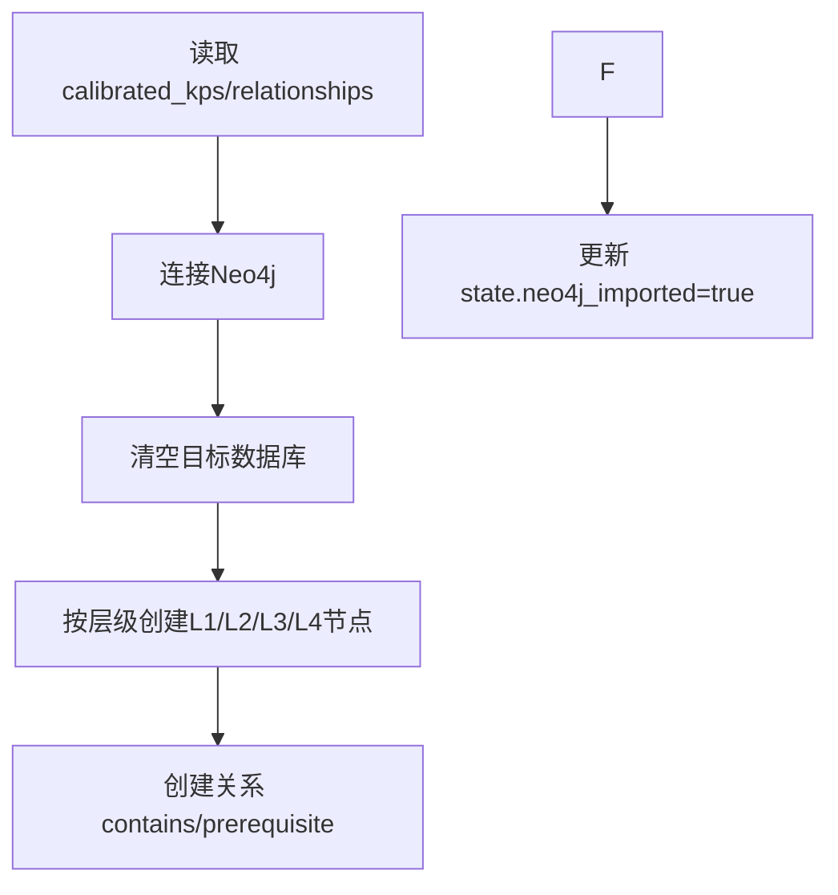

# 步骤8：Neo4j构建（`build_graph`）

对应实现：`knowledge_graph/agents/graph_builder.py`

## 架构流程图

## 详细实现说明

- **输入**
  - `state.calibrated_kps`
  - `state.calibrated_relationships`
- **核心逻辑**
  - 根据配置连接 Neo4j（`config.neo4j`）。
  - 先清空现有图，再全量写入节点和关系。
  - 已支持 `L4` 节点写入。
- **输出**
  - Neo4j 图库中的最终课程图谱。
  - `state.neo4j_imported = True`（成功时）。
- **注意事项**
  - 该实现为全量覆盖导入，不是增量 merge。
  - 当前实现会过滤 `has_resource`，只写入知识点与知识点之间的关系（见 `knowledge_graph/agents/graph_builder.py`）。
  - 若连接失败或Cypher执行异常，会写入 `state.errors`。

